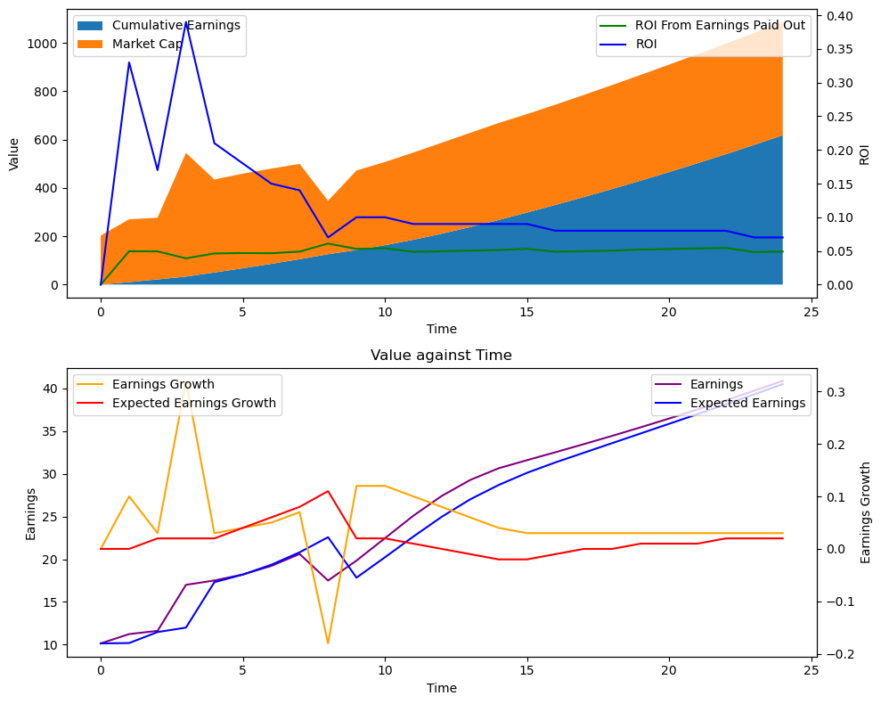
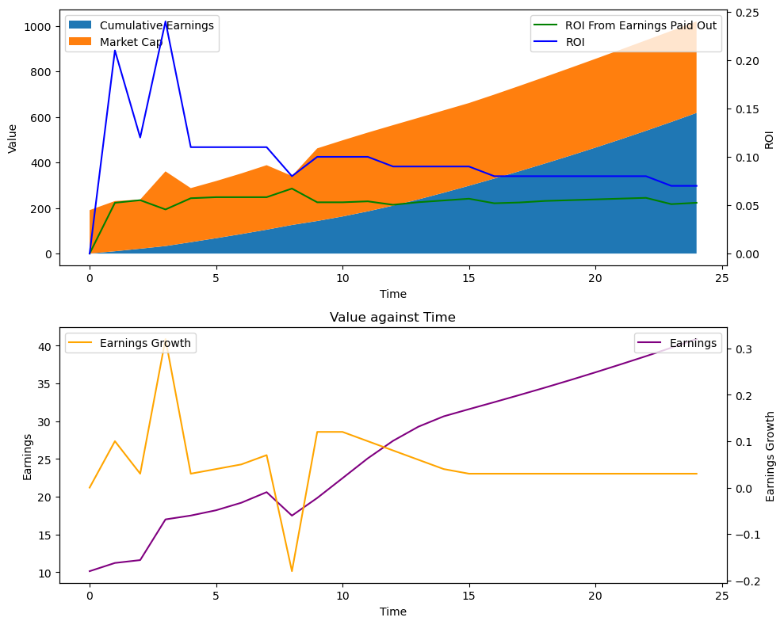

# Investment Theory

A look at models to try to predict the expectation and distribution of the rate of return on various investments over time. **Total Return** on Investment (TR or ROI) is the headline figure.

That said, for these moderately high-earnings-growth scenarios modelled, **capital appreciation**, all of which is part of the **price return**, tends to make up the largest components of return on investment.

## An Example of what I found:

